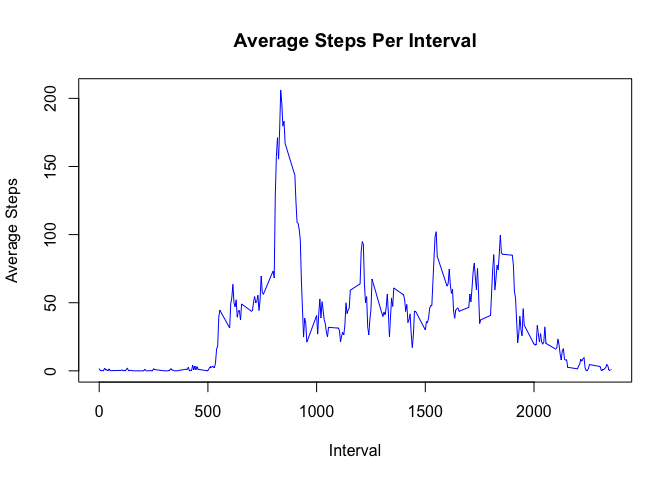
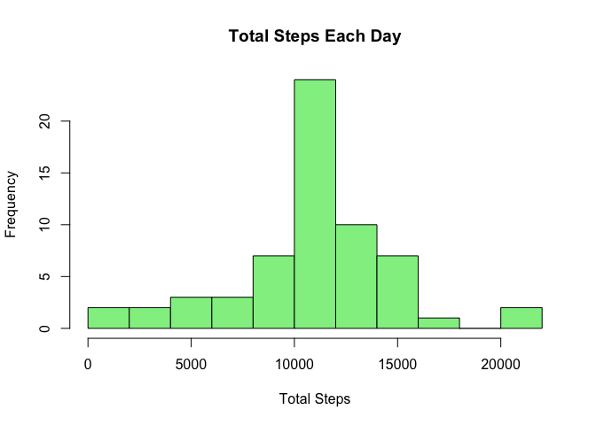
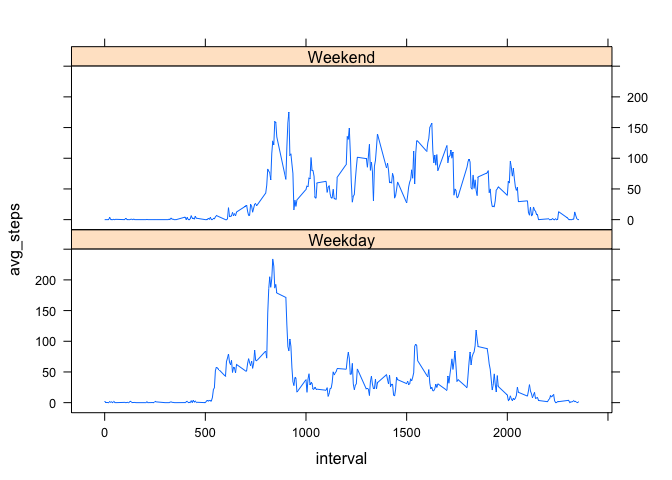

# Analyzing Data from Personal Activity Monitoring Devices
Sahil Patel  
April 30, 2016  


## Introduction

This report lays out the results of analyzing data collected from a personal activity monitoring device over the duration of two months. The dataset contained the number of steps taken by the device user per 5 minute intervals across the two month span. The data was investigated to   

* Study the activity for each day.
* Realize the most active time intervals of the day averaged across all days.
* Comparing the per day activity with NA values ignored and imputed by the interval mean.
* Comparing Weekday vs. Weekend activity.


## Loading and Processing the Data
The dataset was available at <https://d396qusza40orc.cloudfront.net/repdata%2Fdata%2Factivity.zip>. The data was downloaded and formatted for analysis.


```r
## Load the required libraries
library(dplyr)
library(chron)
library(lattice)

initial_dir <- getwd()

## Check if .csv dataset exists, else download and unzip the file
if(file.exists("activity.csv"))
        raw_data <- read.csv("activity.csv") else {
                fileURL <- "https://d396qusza40orc.cloudfront.net/repdata%2Fdata%2Factivity.zip"
                download.file(fileURL, destfile = 'activity.zip', method = "libcurl")
                data_date <- date()
                write(data_date, file = "Data_Download_Date.txt")
                unzip("activity.zip")
                raw_data <- read.csv("activity.csv")
        }

raw_data$date <- as.Date(raw_data$date,"%Y-%m-%d")
```

The dataset thus obtained consisted of three variables, viz.
* Steps: The number of steps taken
* Date: The date when the data was recorded
* Interval: The 5 minute time interval of the 24 hour period

Note: The dataset contains multiple NA values which will be ignored, unless required otherwise.

## What is mean total number of steps taken per day?

From the loaded data, the total number of steps taken each day was calculated as follows:


```r
# Arranging the data by date
by_date <- group_by(raw_data, date)

# Calculating total steps for each day
t_s <- summarize(by_date, Total_Steps = sum(steps, na.rm = TRUE))
```

The new variable, *t_s* contains the total number of steps taken for each date in the dataset. To visualize this information, a histogram was created.


```r
with(t_s, hist(Total_Steps, breaks = 10, col = "lightgreen", main = "Total Steps Each Day", xlab = "Total Steps"))
```

<!-- -->

From the information in variable *t_s*, the mean and median of the total steps taken per day was calculated.


```r
Mean_TS <- mean(t_s$Total_Steps)
Median_TS <- median(t_s$Total_Steps)
```


```
## [1] "The mean total number of steps taken per day is  9354.23 and the median of the total number of steps taken per day is  10395"
```

## What is the average daily activity pattern?
After analyzing the data for each day, it was investigated by averaging the information across all days for the time intervals. A time series plot was created to observe the activity rates at different times of the day, and the interval with the highest activity was calculated.


```r
#Arrange the data by interval id
by_interval <- group_by(raw_data, interval)

#Calculating the average number of steps over total period for each interval
interval_steps <- summarise(by_interval, avg_steps = mean(steps, na.rm = TRUE))

#Time series plot for the average steps per interval
plot(interval_steps, type = "l", col = "blue", main = "Average Steps Per Interval", xlab = "Interval", ylab = "Average Steps") 
```

<!-- -->

```r
max_steps <- interval_steps[which.max(interval_steps$avg_steps),]
```


```
## [1] "The maximum number of steps, i.e., 206.17 occur during interval 835"
```

## Imputing missing values
The NA values in the dataset were substituted by the average values for that given interval. A new histogram of the total number of steps taken each day was created to observe the effect of imputing the missing values in the data set. The mean and median values of the total steps were also calculated with the new imputed dataset.


```r
# Number of rows with NAs. You could also just call the summary function on the raw data
NA_sum <- sum(is.na(raw_data))

# Create new dataset to replace NA values
new_data <- raw_data

# Aranging by interval
by_interval_n <- group_by(new_data, interval)
interval_steps_n <- summarise(by_interval_n, avg_steps_n = mean(steps, na.rm = TRUE))

#Imputing Missing Values with the average step for a given interval
for (i in 1:nrow(new_data)) {
        if(is.na(new_data[i,1])) {
           id_val <- new_data[i,3]
           rep_val <- filter(interval_steps_n, interval == id_val)
           new_data[i,1] <- rep_val[1,2]
        }
}

# Arranging new data by date
by_date_n <- group_by(new_data, date)
t_s_n <- summarize(by_date_n, Total_Steps_n = sum(steps))

Mean_TSN <- mean(t_s_n$Total_Steps_n)
Median_TSN <- median(t_s_n$Total_Steps_n)
Mean_change <- ((Mean_TSN-Mean_TS)/Mean_TS)*100
Median_change <- ((Median_TSN-Median_TS)/Median_TS)*100

#Creating the histogram
with(t_s_n, hist(Total_Steps_n, breaks = 10, col = "lightgreen", main = "Total Steps Each Day", xlab = "Total Steps"))
```

<!-- -->


```
## [1] "The total number of NA values in the raw dataset is 2304"
```

```
## [1] "The mean total number of steps taken per day, after imputing missing values is 10766.19"
```

```
## [1] "The the median of the total number of steps taken per day, after imputing missing values is 10766.19"
```

```
## [1] "The analysis shows that imputing the missing data values increases the mean by 15%, and median total steps per day by 4%"
```

## Are there differences in activity patterns between weekdays and weekends?
Another scenario considered for analysis was the comparison of activity between weekdays and weekends. A time series plot was created to compare the average steps per interval taken on weekdays and weekends.


```r
# Creating new data frame with raw_data + Weekday column
week_data <- mutate(raw_data,
       # day = weekdays(raw_data$date),
       weekend = factor(is.weekend(raw_data$date), labels = c("Weekday", "Weekend"))
       )

# Grouping by interval 
by_interval_w <- group_by(week_data, interval, weekend)

t_s_w <- summarize(by_interval_w, avg_steps = mean(steps, na.rm = TRUE))

# Creating the plot
with(t_s_w, xyplot(avg_steps~interval|weekend, type = "l", layout=c(1,2)))
```

<!-- -->

##End of Report
